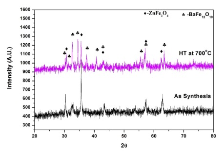
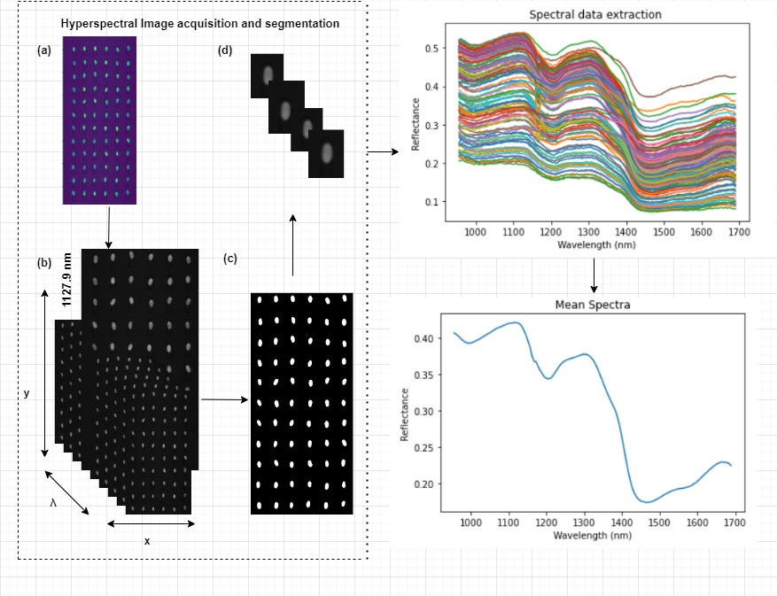
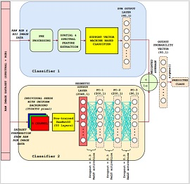
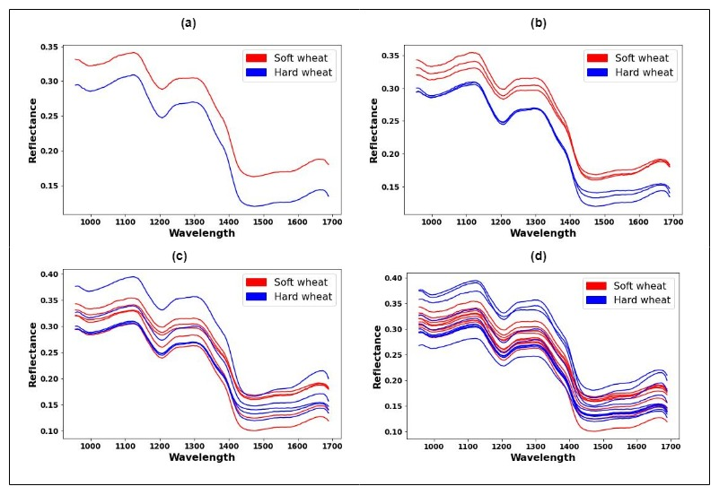

  <a href="https://github.com/nitintyagi007-iitr/nitintyagi007-iitr.github.io/blob/gh-pages/CV_nitin.pdf" class="ui-btn ui-shadow ui-corner-all ui-btn-inline ui-mini" style="float:right"><pre>Resume</pre></a>
  <a href="#Academic_Qualification" class="ui-btn ui-shadow ui-corner-all ui-btn-inline ui-mini" style="float:right"><pre>Qualifications</pre></a>
  <a href="#Publications" class="ui-btn ui-shadow ui-corner-all ui-btn-inline ui-mini" style="float:right"><pre>Publications</pre></a>
  <a href="#Research_Interest" class="ui-btn ui-shadow ui-corner-all ui-btn-inline ui-mini" style="float:right"><pre>Research</pre></a>
  <a href="#About" class="ui-btn ui-shadow ui-corner-all ui-btn-inline ui-mini" style="float:right"><pre>About</pre></a>
 

<html>
<head>

</head>
<body>

  <b>NITIN TYAGI</b> 
Ph.D Scholar  
Dept. of computer Science and Engineering 
IIT Roorkee, Uttarakhand, India 
Email- <i>nitin_t@cs.iitr.ac.in</i> 
Mob- +919582433934 

<h3><b>About</b></h3>

I am Mr. Nitin Tyagi, working as Ph.D. scholar under the supervision of Prof. R. Balasubramanian at Machine vision Lab, Department of Computer Science and Engineering, Indian Institute of Technology Roorkee,Uttarakhand, India. My research interest includes Unsupervised Image Captioning, Image Segmentation, Machine Learning, Deep Learning.

<h3><b>Research Interest</b></h3>
<ol>
  <li>Unsupervised Image Captioning</li>
  <li>Image Segmentation</li>
  <li> Machine Learning</li>
  <li> Deep Learning</li>
</ol> 

## Publications

  

    
  

  

    
Sachin Tyagi, V.S. Pandey, Himanshu B. Baskey, <b>Nitin Tyagi</b>, Avesh Garg, Shivanshu Goel, Trilok Chand Shami, RADAR absorption study of BaFe12O19/ZnFe2O4/CNTs nanocomposite, Journal of Alloys and Compounds, 731 584-590 (2018)

  

  

    
  

  

    
Tyagi, N., Raman, B., Garg, N.M. (2023). Varietal Classification of Wheat Seeds Using Hyperspectral Imaging Technique and Machine Learning Models. In: Gupta, D., Bhurchandi, K., Murala, S., Raman, B., Kumar, S. (eds) Computer Vision and Image Processing. CVIP 2022. Communications in Computer and Information Science, vol 1777. Springer, Cham. https://doi.org/10.1007/978-3-031-31417-9_20

  

  

    
  

  

    
Nitin Tyagi, Yash khandelwal, Pratham Goyal, Yash Asati, Balasubramanian Raman, Indra Gupta, and Neera Garg, FusedNet Model for Varietal Classification of Rice Seeds, Accepted for publication in "International Conference on Agriculture Centric Computation (ICA 2023)", May 11-13,2023, IIT Ropar, Punjab, India.[Accepted][Best Paper Award]

  

  

    
  

  

    
Nitin Tyagi, Balasubramanian Raman, Neera Garg, Classification of Hard and Soft Wheat Species using Hyperspectral Imaging and Machine Learning Models. Acceepted for the publication in the "30th International Conference on Neural Information Processing (ICONIP2023)" will be held in Changsha, China, November 20-23, 2023.[Accepted]

  

</body>
</html>

Course/class |  Year of Passing | University/School
------------ | -------------
Ph.D(CSE) | 2019(Pursuing) | IIT Roorkee, Uttarakhand
M.Tech | 2014 | Thapar University,Patiala,Punjab
MCA | 2009 | Kurukshetra University, Haryana
B.Sc(Chemistry) | 2004 | A.R.S.D College,Delhi University

### Award and Fellowship
1. Awarded MHRD fellowship for pursuing Ph.D at IIT Roorkee
2. Qualified GATE 2012
3. Awarded GATE fellowship during M.Tech in Computer Science and Engineering Department at Thapar University, Patiala, Punjab

### Workshop Attended
1. Participated in National workshop on LEVERAGING TECHNOLOGIES USING ERP AND OPEN SOURCE TECHNOLOGY organized by Technia Institute of Advanced Studies, Rohini Delhi
2. Participated in workshop on EMERGING TRENDS IN INFORMATION TECHNOLOGY organized by DIRD college, Delhi

### M.Tech Dissertation
Dissertation Topic: **"Development and Implementation of Algorithm to Remove Back to Front Interference in Historical Stained Documents"** 
Name of supervisor:  Dr. Rajiv Kumar 
&nbsp;&nbsp;&nbsp;&nbsp;&nbsp;&nbsp;&nbsp;&nbsp;&nbsp;&nbsp;&nbsp;&nbsp;&nbsp;&nbsp;&nbsp;&nbsp;&nbsp;&nbsp;&nbsp;&nbsp;&nbsp;&nbsp;&nbsp;&nbsp;&nbsp;&nbsp;&nbsp;&nbsp;&nbsp;&nbsp;&nbsp;&nbsp;&nbsp;&nbsp;&nbsp;&nbsp;&nbsp;&nbsp;Associate Professor,Dept. Of CSE, Thapar University,Patiala Punjab

### MCA Dissertation
Dissertation Topic: **"Image Segmentation using DBSCAN(Density-based spatial clustering of applications with noise) Algorithm in Java"** 
Name of Supervisor: Dr. Kanwal Garg

### Work Experience
1. Worked as Assistant Professor in Kalka Institute for Research & Advanced Studies college affiliated from GGSIP University Delhi from 2014 -2017
2. Worked as Assistant Professor in Kalka Institute for Research & Advanced Studies college affiliated from GGSIP University Delhi from 2011 -2012
3. Worked as Assistant Professor in Delhi Institute of Rural Development college affiliated from GGSIP University Delhi from 2010-2011
4. Worked in Research India Publication from 2009-2010
5. Selected for 6 months Deloitte studentship program 

### Achievements
1. Won zonal tournament of volley ball in 1995-96 with **first position**.
2. Won inter zonal tournament of volley ball in 1995-96 with **first position**.
3. Won zonal tournament of volley ball 1996-97 with **first position**.
4. Won inter zonal tournament of volley ball 1996-97 with **first position**.
5. Participate in v mini **National Volley Ball championship** at Barasat stadium (West Bengal) in December 1996
6. NCC Certificate.

